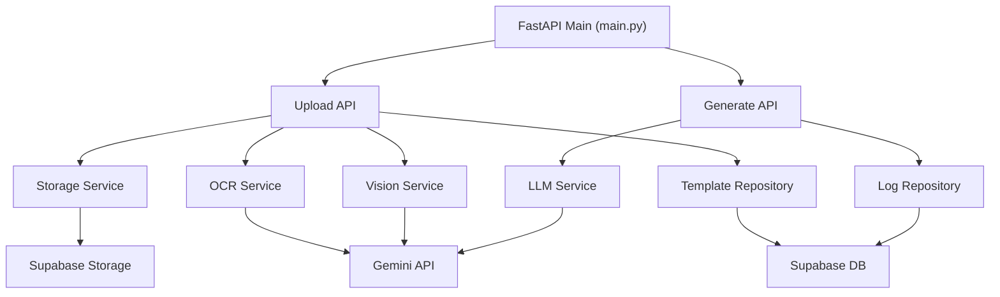

# Nuri-GPT Backend Architecture

## 계층 구조

| 계층 | 경로 | 역할 |
|------|------|------|
| API Layer | `api/endpoints/` | FastAPI 라우팅, Pydantic 요청/응답 검증 |
| Service Layer | `services/` | 핵심 비즈니스 로직 (OCR, LLM, Vision, Storage) |
| Repository Layer | `db/repositories/` | DB CRUD 추상화 |
| Infrastructure | — | Supabase DB/Storage, Gemini Flash API 연동 |

---

## 모듈 의존성



---

## 데이터 흐름

> 엔드포인트 스키마 상세: `API_REFERENCE.md`

1. **수기 메모 입력**: 이미지 업로드 → Storage 저장 → Vision OCR → 텍스트 정규화 반환
2. **템플릿 등록**: 이미지 업로드 → Vision Service로 계층 구조 JSON 추출 → Storage 원본 저장 + DB에 `structure_json` 기록
3. **일지 생성**: 정규화 텍스트 + `tone_and_manner` → LLM Service → 구조화된 관찰일지 JSON → DB 이력 저장
4. **결과 출력**: 완성된 일지 JSON을 프론트엔드로 전달

---

## Vision → JSON 파이프라인

두 트랙이 독립 실행 후 프론트엔드에서 조합됩니다.

| 트랙 | 입력 | 처리 | 출력 |
|------|------|------|------|
| **Track A** (템플릿 분석) | 빈 템플릿 이미지 | Vision API → 시각적 레이아웃 파싱 | `structure_json` (항목 계층 구조) |
| **Track B** (내용 생성) | 수기 메모 OCR 텍스트 | LLM Service + `tone_and_manner` 적용 | `log_data` (구조화된 일지 내용) |
| **Frontend Assembly** | `structure_json` + `log_data` | 매칭 및 렌더링 | 최종 문서 |
```
