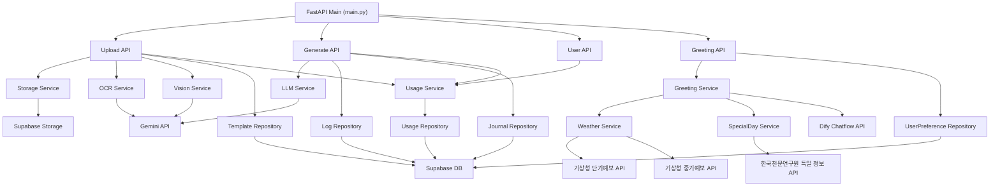

# Nuri-GPT Backend Architecture

## 계층 구조

| 계층 | 경로 | 역할 |
|------|------|------|
| API Layer | `api/endpoints/` | FastAPI 라우팅, Pydantic 요청/응답 검증 |
| Service Layer | `services/` | 핵심 비즈니스 로직 (OCR, LLM, Vision, Storage, Usage, Weather, Greeting, SpecialDay) |
| Repository Layer | `db/repositories/` | DB CRUD 추상화 (Template, Log, Journal, Usage, UserPreference) |
| Infrastructure | — | Supabase DB/Storage, Gemini Flash API 연동 |

---

## 모듈 의존성

---

## 데이터 흐름

> 엔드포인트 스키마 상세: `API_REFERENCE.md`

1. **수기 메모 입력**: 이미지 업로드 → Storage 저장 → Vision OCR → 텍스트 정규화 반환
2. **템플릿 등록**: 이미지 업로드 → Vision Service로 계층 구조 JSON 추출 → Storage 원본 저장 + DB에 `structure_json` 기록
3. **일지 생성**: 정규화 텍스트 + `tone_and_manner` → LLM Service → 구조화된 관찰일지 JSON → DB 이력 저장
4. **결과 출력**: 완성된 일지 JSON을 프론트엔드로 전달
5. **인삿말 생성**: 시군구+날짜 → WeatherService(단기/중기 분기) → 날씨 요약 + SpecialDayService(공휴일/절기/기념일/잡절) → 날짜/절기/기념일 맥락 → Dify Chatflow → 인삿말 텍스트 → UserPreferenceRepository에 `greeting.preferred_region` 저장

---

## 사용자 설정 (User Preferences)

범용 key-value 저장소. `users` 테이블의 컬럼 대신 `user_preferences` 테이블에서 관리.

| 컬럼 | 타입 | 설명 |
|------|------|------|
| `user_id` | UUID (FK) | 사용자 ID |
| `key` | VARCHAR(100) | 설정 키 (`{feature}.{name}` 네이밍) |
| `value` | JSONB | 설정 값 |
| `updated_at` | TIMESTAMPTZ | 갱신 시각 |

PK: `(user_id, key)`. RLS: 본인만 읽기/쓰기.

현재 사용 중인 키:
- `greeting.preferred_region`: 인삿말 생성 시 선택한 시군구 (문자열)

향후 추가 예시: `observation.default_template`, `notification.enabled` 등

---

## Vision → JSON 파이프라인

두 트랙이 독립 실행 후 프론트엔드에서 조합됩니다.

| 트랙 | 입력 | 처리 | 출력 |
|------|------|------|------|
| **Track A** (템플릿 분석) | 빈 템플릿 이미지 | Vision API → 시각적 레이아웃 파싱 | `structure_json` (항목 계층 구조) |
| **Track B** (내용 생성) | 수기 메모 OCR 텍스트 | LLM Service + `tone_and_manner` 적용 | `log_data` (구조화된 일지 내용) |
| **Frontend Assembly** | `structure_json` + `log_data` | 매칭 및 렌더링 | 최종 문서 |
---

## 할당량 관리 정책 (Quota Policy)

1. **미차감 정책 (Success-only Consumption)**: LLM 요청이 성공하여 실제 결과물이 생성된 경우에만 할당량을 차감합니다.
2. **실패 로깅**: API 오류나 LLM 런타임 예외 발생 시에는 할당량을 차감하지 않되, `fail_count`를 별도로 기록하여 관리자 모니터링에 활용합니다.
3. **KST 기준 리셋**: 매일 00:00(KST) 및 매주 월요일 00:00(KST)에 사용량이 초기화됩니다.
4. **기능 제어**: 할당량 초과 시 `429 Too Many Requests`를 반환하여 추가 요청을 차단합니다.

---

*Last Updated: 2026-04-17*

#### 2026-04-17 — 사용자 설정 (User Preferences) 시스템

- **`user_preferences` 테이블** 신규 생성 (복합 PK: user_id + key, JSONB value)
- **`app/db/repositories/user_preference_repository.py`** get_all, upsert, upsert_many, delete 메서드
- **`app/api/endpoints/user.py`** GET/PATCH `/me/preferences` 엔드포인트 추가
- **`app/api/endpoints/auth.py`** login/refresh/signup 응답에 preferences 포함
- **`app/api/endpoints/greeting.py`** UserUpdate(preferred_region) → UserPreferenceRepository.upsert("greeting.preferred_region") 로 이관
- **`users.preferred_region` 컬럼** 제거, 기존 데이터 `user_preferences`로 이관

#### 2026-04-16 — 특일 정보 API 연동

- **`app/services/special_day.py`** SpecialDayService + SpecialDayCache 신규 추가
  - 한국천문연구원 특일 정보 OpenAPI (getRestDeInfo, get24DivisionsInfo, getAnniversaryInfo, getSundryDayInfo) 연동
  - 차등 TTL 캐시: 당월 12시간 / 미래월 7일, grace period 24시간
  - 임시공휴일·음력공휴일·대체공휴일 자동 반영
  - API 키 미설정 또는 장애 시 하드코딩 fallback
- **`app/services/greeting.py`** 하드코딩 상수 → `_FALLBACK_*` 로 전환, SpecialDayService 주입
  - Dify inputs에 `anniversary_info`, `sundry_day_info` 키 추가
- **`app/core/config.py`** `KMA_SPECIAL_DAY_API_KEY` 설정 추가
